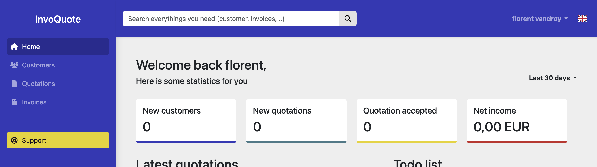

# Invoquote (Laravel Version)

## Description

Invoquote is a web application developed using Laravel, designed to streamline business processes by facilitating the creation and sharing of company profiles and generating invoices and quotes for various clients. It provides a platform for users to efficiently manage their business transactions and client relationships.

## Getting Started

### Dependencies

* PHP
* Laravel Framework
* MySQL or any compatible database management system

### Installing

1. Clone the repository from [GitHub](https://github.com/example/invoquote).
2. Navigate to the project directory.
3. Run `composer install` to install dependencies.
4. Configure the `.env` file with your database credentials.
5. Run `php artisan migrate` to migrate the database.

### Executing program

1. Run `php artisan serve` to start the server.
2. Open your web browser and navigate to `http://localhost:8000`.

## Authors

* Florent Vandroy

## License

This project is licensed under the MIT License - see the [LICENSE.md](LICENSE.md) file for details.
